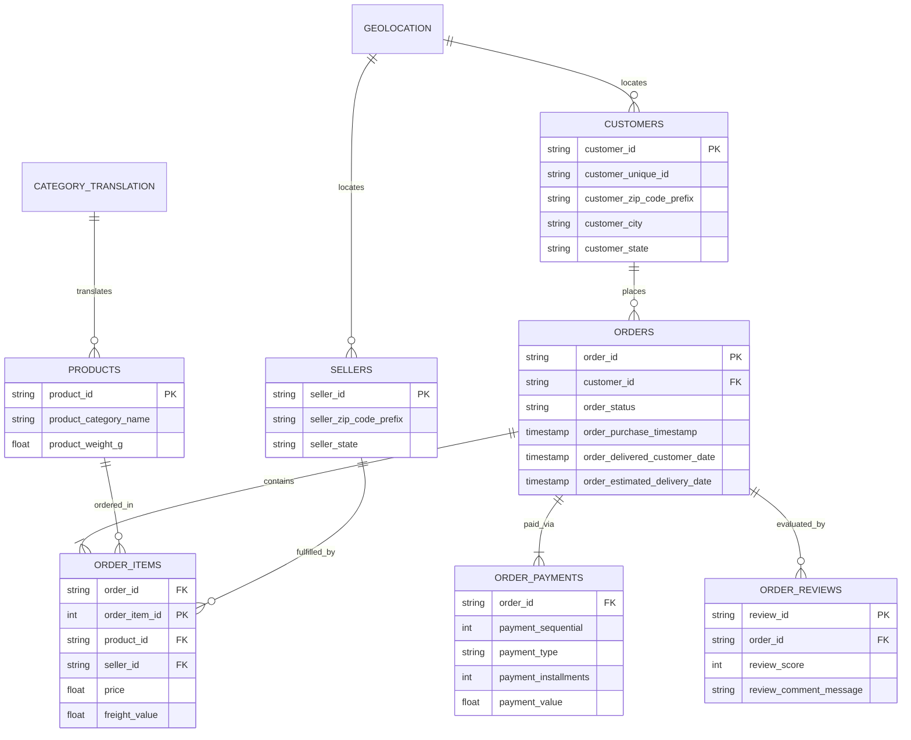

# 🛒 Brazilian E-Commerce Analytics & Machine Learning Platform

[](https://www.python.org/)
[](https://streamlit.io/)
[](https://scikit-learn.org/)
[](https://www.sqlite.org/)
[](https://opensource.org/licenses/MIT)

Proyek analisis data dan pemodelan prediktif *end-to-end* berskala industri menggunakan **Olist Brazilian E-Commerce Public Dataset** (~100.000 pesanan dari tahun 2016 hingga 2018). Repositori ini mencakup pipeline ETL lengkap, Exploratory Data Analysis (EDA), segmentasi pelanggan (RFM + K-Means), Natural Language Processing (NLP) ulasan konsumen, model Machine Learning untuk memprediksi risiko keterlambatan pengiriman, serta aplikasi web dashboard interaktif berbasis **Streamlit**.

---

## 📌 Daftar Isi
- [Ringkasan Eksekutif & Latar Belakang Bisnis](#-ringkasan-eksekutif--latar-belakang-bisnis)
- [Arsitektur Data & Diagram ERD](#-arsitektur-data--diagram-erd)
- [Temuan Kunci Analisis Data (EDA)](#-temuan-kunci-analisis-data-eda)
- [Modul Lanjutan Data Science & Machine Learning](#-modul-lanjutan-data-science--machine-learning)
  - [1. Segmentasi Pelanggan: RFM & K-Means Clustering](#1-segmentasi-pelanggan-rfm--k-means-clustering)
  - [2. Model Prediksi Keterlambatan Pengiriman (ROC-AUC 0.753)](#2-model-prediksi-keterlambatan-pengiriman-roc-auc-0753)
  - [3. NLP & Text Mining Ulasan Konsumen](#3-nlp--text-mining-ulasan-konsumen)
- [Aplikasi Dashboard Interaktif (Streamlit)](#-aplikasi-dashboard-interaktif-streamlit)
- [Rekomendasi Strategis untuk Bisnis](#-rekomendasi-strategis-untuk-bisnis)
- [Panduan Instalasi & Menjalankan Proyek](#-panduan-instalasi--menjalankan-proyek)

---

## 🏢 Ringkasan Eksekutif & Latar Belakang Bisnis

Olist menghubungkan usaha kecil di berbagai wilayah Brasil ke marketplace e-commerce terkemuka. Tantangan utama yang dihadapi platform ini adalah:
1. **Kendala Logistik Geografis**: Wilayah Brasil yang luas menyebabkan pengiriman lintas negara bagian rawan mengalami keterlambatan.
2. **Kepuasan Pelanggan**: Mengidentifikasi apa faktor primer yang memicu rating bintang 1 vs bintang 5.
3. **Retensi Pelanggan**: Rendahnya pembelian berulang (*repeat order*), di mana mayoritas pelanggan hanya berbelanja satu kali.

Proyek ini dirancang untuk menjawab tantangan tersebut melalui pendekatan berbasis data dan *Artificial Intelligence*.

---

## 🗄️ Arsitektur Data & Diagram ERD

Dataset terdiri dari 9 tabel relasional yang diintegrasikan ke dalam database SQLite lokal (`ecommerce.db`):



---

## 📊 Temuan Kunci Analisis Data (EDA)

| Pertanyaan Bisnis | Temuan Kunci Berbasis Data | Implikasi Bisnis |
| :--- | :--- | :--- |
| **Tren Pertumbuhan** | Transaksi tumbuh ~8x lipat (2017 ke 2018). Puncak penjualan tertinggi terjadi pada **Black Friday November 2017** (7.289 pesanan; omzet R$ 1,01 Juta). | Antisipasi lonjakan server & kesiapan stok gudang pada event Q4. |
| **Kategori Unggulan** | `bed_bath_table` memimpin volume (10.953 item). `health_beauty` memimpin omzet (R$ 1,23 Juta). | Alokasi anggaran iklan terbesar untuk kategori dengan margin dan volume tinggi. |
| **Distribusi Wilayah** | **São Paulo (SP)** menampung **42,0% pembeli** dan **59,7% penjual**. Luar SP (RJ, MG, RS) memiliki permintaan tinggi namun sedikit penjual lokal. | Perlunya mini-hub logistik regional untuk melayani rute lintas negara bagian. |
| **Kinerja Logistik** | Pesanan tepat waktu (92,0%) mencatat rating **4,29 ⭐**. Pesanan terlambat (8,0%, rata-rata 31,4 hari) **anjlok drastis ke 2,57 ⭐** (-1,72 bintang). | **Keterlambatan logistik adalah pemicu nomor 1 ulasan buruk**, bukan kualitas produk. |
| **Pola Pembayaran** | **73,9% Kartu Kredit**, 19,0% Boleto, 5,5% Voucher. Rata-rata cicilan kartu kredit adalah **3,5 kali**. | Opsi cicilan fleksibel sangat penting untuk menstimulasi pembelian barang bernilai menengah-tinggi. |

---

## 🧠 Modul Lanjutan Data Science & Machine Learning

### 1. Segmentasi Pelanggan: RFM & K-Means Clustering
- **Tingkat Retensi**: Hanya **3,0%** pelanggan yang berbelanja lebih dari 1 kali.
- **Customer Lifetime Value (CLV)**: Pelanggan *repeat order* membelanjakan rata-rata **R$ 260,05** (hampir **2x lipat** dari pelanggan sekali beli seharga R$ 137,96).
- **Cluster Karakteristik**:
  1. *Champions*: Pelanggan dengan frekuensi belanja tinggi dan loyalitas tertinggi.
  2. *High-Value One-Time Buyers*: Membeli produk bernilai tinggi dalam sekali transaksi.
  3. *Recent Regulars*: Pembeli aktif baru dengan nilai belanja rata-rata.
  4. *At-Risk / Inactive*: Pelanggan lama yang belum kembali berbelanja (>1 tahun).

### 2. Model Prediksi Keterlambatan Pengiriman (ROC-AUC 0.753)
Membangun model klasifikasi prediktif (*Random Forest Classifier*) untuk memprediksi risiko keterlambatan pengiriman pada saat pesanan pertama kali dibuat.
- **Hasil Benchmark**:
  - *Baseline Logistic Regression*: ROC-AUC **0.654**
  - *Random Forest Classifier*: ROC-AUC **0.753**
- **Fitur Paling Berpengaruh**:
  1. `estimated_delivery_days`: Janji durasi SLA pengiriman.
  2. `freight_value` & `freight_ratio`: Biaya ongkir dan porsinya terhadap nilai barang.
  3. `product_weight_g`: Berat fisik paket kargo.
  4. `is_interstate`: Rute pengiriman antar negara bagian.

### 3. NLP & Text Mining Ulasan Konsumen
Mengekstrak frasa kunci dari ribuan komentar ulasan pelanggan dalam bahasa Portugis:
- **Ulasan Negatif (⭐ 1 - 2)** didominasi oleh:
  - *não entregue* (tidak dikirim)
  - *até agora* (sampai sekarang belum tiba)
  - *não recomendo* (tidak direkomendasikan)
  - *nota fiscal* (masalah faktur pajak)
- **Ulasan Positif (⭐ 4 - 5)** didominasi oleh:
  - *entrega rápida* (pengiriman cepat)
  - *bem embalado* (kemasan sangat aman dan rapi)
  - *super recomendo* (sangat direkomendasikan)
  - *ótima qualidade* (kualitas produk luar biasa)

---

## 🖥️ Aplikasi Dashboard Interaktif (Streamlit)

Aplikasi web interaktif telah dibangun di folder [`dashboard/app.py`](file:///d:/Project%20Analysis%20Personal/Brazilian%20E-Commerce%20Public%20Dataset/dashboard/app.py) dengan fitur:
- **Executive KPI Cards**: Real-time total GMV, jumlah pesanan, rating, dan on-time rate.
- **Interactive Visuals**: Grafik tren penjualan bulanan, top kategori, dan komposisi pembayaran berbasis Plotly.
- **Logistics Comparison**: Analisis komparasi durasi pengiriman on-time vs delayed.
- **AI Delivery Delay Risk Calculator**: Form simulator interaktif di mana pengguna dapat memasukkan data pesanan baru untuk memprediksi probabilitas keterlambatan dan memperoleh rekomendasi mitigasi operasional secara otomatis.

---

## 🎯 Rekomendasi Strategis untuk Bisnis

1. **Sistem Peringatan Dini Operasional (Early Warning System)**:  
   Gunakan model prediksi keterlambatan untuk mendeteksi pesanan berisiko tinggi (`risk >= 25%`) saat pesanan diterima. Alihkan rute tersebut ke kurir ekspres atau tambahkan *buffer SLA* 2-3 hari pada estimasi yang ditampilkan ke pembeli.
2. **Mini-Fulfillment Hub di Luar São Paulo**:  
   Buka hub konsinyasi di Rio de Janeiro dan Minas Gerais guna memangkas durasi pengiriman antar-state yang rata-rata mencapai 30+ hari jika terjadi keterlambatan.
3. **Mesin Pendorong Retensi (Retention Engine)**:  
   Kirimkan otomatis voucher diskon ongkir untuk pembelian kedua dalam 14 hari setelah pesanan pertama diterima. Menaikkan retensi repeat order dari 3% ke 6% berpotensi meningkatkan omzet tahunan secara masif tanpa menambah biaya akuisisi pelanggan baru.

---

## 🚀 Panduan Instalasi & Menjalankan Proyek

### 1. Kloning Repositori & Persiapan Lingkungan
```bash
git clone https://github.com/Azuredeer/project-analysis--brazilian-ecommerce-public.git
cd project-analysis--brazilian-ecommerce-public
```

### 2. Buat & Aktifkan Virtual Environment
```bash
python -m venv .venv
# Windows:
.\.venv\Scripts\activate
# Linux/MacOS:
source .venv/bin/activate
```

### 3. Instal Dependensi
```bash
pip install -r requirements.txt
```

### 4. Menjalankan Jupyter Notebook
```bash
jupyter notebook analysis_ecommerce.ipynb
```

### 5. Menjalankan Dashboard Streamlit
```bash
streamlit run dashboard/app.py
```
Aplikasi dashboard interaktif akan otomatis terbuka di browser Anda pada alamat `http://localhost:8501`.

---

## 👨‍💻 Kontributor
- **Yoan Rifqi Candra** ([GitHub](https://github.com/Azuredeer))
